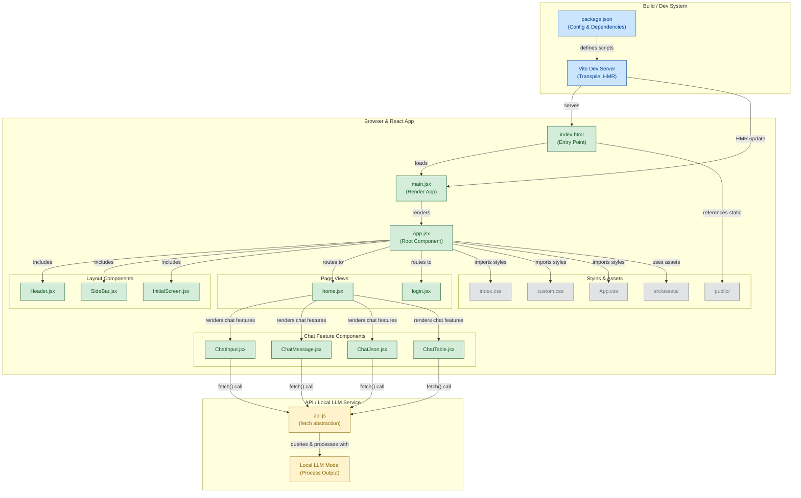

# AIXOPS FrontEnd 

```mermaid
flowchart TD
    %% Build / Dev System
    subgraph "Build / Dev System"
        direction TB
        Vite["Vite Dev Server<br/>(Transpile, HMR)"]:::buildtools
        Package["package.json<br/>(Config & Dependencies)"]:::buildtools
    end

    %% Runtime / Browser
    subgraph "Browser & React App"
        direction TB
        HTML["index.html<br/>(Entry Point)"]:::runtime
        Main["main.jsx<br/>(Render App)"]:::runtime
        App["App.jsx<br/>(Root Component)"]:::runtime

        subgraph "Layout Components"
            direction TB
            Header["Header.jsx"]:::runtime
            SideBar["SideBar.jsx"]:::runtime
            InitialScreen["InitialScreen.jsx"]:::runtime
        end

        subgraph "Page Views"
            direction TB
            Home["home.jsx"]:::runtime
            Login["login.jsx"]:::runtime
        end

        subgraph "Chat Feature Components"
            direction TB
            ChatInput["ChatInput.jsx"]:::runtime
            ChatMessage["ChatMessage.jsx"]:::runtime
            ChatJson["ChatJson.jsx"]:::runtime
            ChatTable["ChatTable.jsx"]:::runtime
        end

        subgraph "Styles & Assets"
            direction TB
            GlobalCSS["index.css"]:::assets
            CustomCSS["custom.css"]:::assets
            AppCSS["App.css"]:::assets
            PublicAssets["public/"]:::assets
            AppAssets["src/assets/"]:::assets
        end
    end

    %% API / Stub Service
    subgraph "API / Local LLM Service"
        direction TB
        API["api.js<br/>(fetch abstraction)"]:::service
        LocalLLM["Local LLM Model<br/>(Process Output)"]:::service
    end

    %% Connections
    Vite -->|"serves"| HTML
    Vite -->|"HMR update"| Main
    Package -->|"defines scripts"| Vite

    HTML -->|"loads"| Main
    Main -->|"renders"| App

    App -->|"includes"| Header
    App -->|"includes"| SideBar
    App -->|"includes"| InitialScreen

    App -->|"routes to"| Home
    App -->|"routes to"| Login

    Home -->|"renders chat features"| ChatInput
    Home -->|"renders chat features"| ChatMessage
    Home -->|"renders chat features"| ChatJson
    Home -->|"renders chat features"| ChatTable

    ChatInput -->|"fetch() call"| API
    ChatMessage -->|"fetch() call"| API
    ChatJson -->|"fetch() call"| API
    ChatTable -->|"fetch() call"| API

    API -->|"queries & processes with"| LocalLLM

    App -->|"imports styles"| GlobalCSS
    App -->|"imports styles"| CustomCSS
    App -->|"imports styles"| AppCSS

    HTML -->|"references static"| PublicAssets
    App -->|"uses assets"| AppAssets

    %% Click Events
    click Vite "https://github.com/tsk-balaji/aixops-frontend/blob/main/vite.config.js"
    click Package "https://github.com/tsk-balaji/aixops-frontend/blob/main/package.json"
    click HTML "https://github.com/tsk-balaji/aixops-frontend/blob/main/index.html"
    click Main "https://github.com/tsk-balaji/aixops-frontend/blob/main/src/main.jsx"
    click App "https://github.com/tsk-balaji/aixops-frontend/blob/main/src/App.jsx"
    click Header "https://github.com/tsk-balaji/aixops-frontend/blob/main/src/components/Header.jsx"
    click SideBar "https://github.com/tsk-balaji/aixops-frontend/blob/main/src/components/SideBar.jsx"
    click InitialScreen "https://github.com/tsk-balaji/aixops-frontend/blob/main/src/components/InitialScreen.jsx"
    click Home "https://github.com/tsk-balaji/aixops-frontend/blob/main/src/components/pages/home.jsx"
    click Login "https://github.com/tsk-balaji/aixops-frontend/blob/main/src/components/pages/login.jsx"
    click ChatInput "https://github.com/tsk-balaji/aixops-frontend/blob/main/src/components/ChatInput.jsx"
    click ChatMessage "https://github.com/tsk-balaji/aixops-frontend/blob/main/src/components/ChatMessage.jsx"
    click ChatJson "https://github.com/tsk-balaji/aixops-frontend/blob/main/src/components/ChatJson.jsx"
    click ChatTable "https://github.com/tsk-balaji/aixops-frontend/blob/main/src/components/ChatTable.jsx"
    click API "https://github.com/tsk-balaji/aixops-frontend/blob/main/src/utils/api.js"
    click LocalLLM "https://github.com/tsk-balaji/aixops-frontend/blob/main/src/stub/response.json"
    %% Update link if a new file is created for LLM
    click PublicAssets "https://github.com/tsk-balaji/aixops-frontend/tree/main/public/"
    click AppAssets "https://github.com/tsk-balaji/aixops-frontend/tree/main/src/assets/"
    click GlobalCSS "https://github.com/tsk-balaji/aixops-frontend/blob/main/src/index.css"
    click CustomCSS "https://github.com/tsk-balaji/aixops-frontend/blob/main/src/styles/custom.css"
    click AppCSS "https://github.com/tsk-balaji/aixops-frontend/blob/main/src/App.css"

    %% Styles
    classDef buildtools fill:#cce5ff,stroke:#004085,color:#004085
    classDef runtime fill:#d4edda,stroke:#155724,color:#155724
    classDef service fill:#fff3cd,stroke:#856404,color:#856404
    classDef assets fill:#e2e3e5,stroke:#6c757d,color:#6c757d
```
